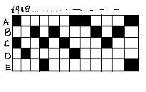

# Image Processing and Recognition Basics

## How to run the code? 🤔 (find below 😉)

To find the answers that student has marked from his answer sheet, Try running the code below:
```
python3 ./grade.py a-3.jpg output.txt

```

Where grade.py is the required python program to extract student answers from the omr sheet,
a-3.jpg is the omr sheet image present in test-images folder,
output.txt is the output file name which has the extracted student answers.

To Encode the ground truth answers on the sheet, you can use the below command:
```
python3 ./inject.py a-3.jpg a-3_groundtruth.txt injected.jpg
```

where inject.py is the python program to encode the ground truth answers on the omr sheet,
a-3.jpg is the omr sheet image present in test-images folder,
a-3_groundtruth.txt is the file with correct answers,
injected.jpg is the output image with the encoding.

To Extract the ground truth answers from the sheet, you can use the below command:
```
python3 ./extract.py injected.jpg groundtruth.txt
```
Where extract.py is the python program to extract the ground truth answers from the encoding performed,
injected.jpg is the image file with the encoding,
groundtruth.txt is the output file which will have the ground truth answers extracted from encoding

## Design / Design Decisions / Assumptions

1. For Recognising the student marked options, a looping technique was used to cover the options A, B, C, D, E for each question. Given the center position of option A of column 1, there is a constant x increment that is used to iterate over the options, for each option, a radius of 20 (40X40 square box) is taken to collect all the pixels which are either black or white. If there are more than 25% pixels which are black, it is considered as a marked option. After checking through all options of a question, there is a constant y increment to go to next question. After completing first column of questions, the next column values are taken into consideration.

2. To find the manual mark for a question, from the center of option A, 105 pixels to the left was chosen as the new center, and a radius of  25 pixels was taken, and all the pixels in the square region of 50X50 are considered, and if more than 50 pixels are present, we considered a manual mark on the sheet for that question.

3. For injecting the ground truth answers on the paper, a 5 X 85 matrix is used in which the question numbers are the column values, with question numbers following some hardcoded pattern, that starts with 69th question, followed by 18th question, followed by 41st question, followed by 53rd question and soon.
For Each column, based on the options, the cells are filled black.
For example if the 69th question answer is A and C, then 1st and 3rd boxes are filled of column 1 are filled. This way encoding is performed. It also has a padding of 50 from left and top to center it well.



4. For extraction, the reverse process is used , the program first binarizes the image and checks at the required pixel area, by a loop of question numbers starting from 69...( a pattern we hardcoded for the students not to find the question sequence) and output it to a text file.

5. The assumption is finding 5 values namely, center of option A in three columns, x increment and y increment which are hardcoded, assuming that the omr sheet doesn't change by more than 2-3 degrees in rotation.

6. Another assumption is there shouldn't be much pixel intensity difference when the form is filled and scanned again and measured.

## Accuracy on test-images

1. Accuracy on the a-3.jpg image is 98.823%, but ideally the ground truth data provided has wrong options marked in comparision to the omr sheet. It is 100% ideally.

2. Accuracy on the a-27.jpg image is 98.823%.

3. Accuracy on the a-30.jpg and a-48.jpg is 100%.

These accuracies are pretty good and robust enough in most of the cases.

The advantages of this approach is it is pretty fast in comparision to the approaches using edge detection and corner detection. This uses simple looping process, and finding the number of required pixels.

## Challenges encountered and their resolutions

1. Initially, we experimented with a combination of Canny edge detection, Hough transform, and Gaussian blur for image preprocessing to detect option boxes. However, we faced difficulties in setting general thresholds that would consistently provide accurate bounding boxes for options across various test cases. Additionally, this method proved to be computationally intensive, leading to longer execution times. Consequently, we opted for our current approach, which involves iterating through questions with predefined x and y increments based on the positions of the first question in each column.

2. Another challenge arose when we attempted to create a barcode solution from scratch. Unfortunately, we realized that the generated barcode was too large to fit onto the page in a manner that would remain intact after printing and rescanning. After that we tried to convert our answer sheet and encode the ascii value as a pixel. But that too wasnt very accurate due to the change in pixel values while saving it as a jpeg file. As a result, we pivoted to our current strategy of marking answers using blocks of pixels and shuffling the question numbers in the answer key to prevent easy interpretation by students.

## Future work

1. Ideally, instead of hard-coding the coordinates of the first question in each column, they should be determined dynamically through corner detection and option box detection, leveraging libraries like OpenCV for this purpose.

## Contributions of the Authors

Gautam Kataria:
1. Browsing papers and web for how to perform corner detection and edge detections and hence trying to find the approach on solving the given problem.
2. Implementation of the grade.py, which is the python program to find the student marked answers, including the design of manual marking system, and find the options marked.
3. Debugging the code of inject.py and extract.py and helped in its implementation.
4. Future work and Challenges encountered and their resolutions part of the report.


Aaryan Agarwal:
1. Browsing web and papers to get an idea how people solved such type of problems in the past to get an overall idea.
2. Implementation of the inject.py and extract.py programs used to encode the correct answers and then extract these answers from the omr.
3. Initially implemented the encoding part using the pixel intensity and create a bar scan of the ground truth answers.

Ajay Reddy Gajulapally:
1. Formulating the approach of looping through the question options and checking if the option was marked. 
2. Ideation for the Encoding of the correct answers to the omr sheet and shuffling the question numbers ( for students not to find the answers from omr)
3. Final updating files to take file input names and output names, and running the code on luddy linux servers to check for errors, Implementing findMatch.py file to check the difference in lines and hence printing the accuracy.
4. Completing the Report - on how to run the code, explaining the approach of the code,  Accuracies, Assumptions and Contributions.

